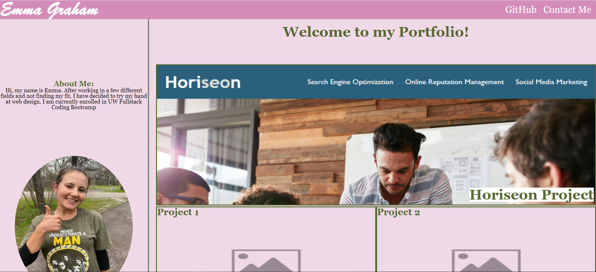

# Homework Assignment 2 - Professional Portfolio

## Your Task:
This week's homework required us to make a Portfolio to showcase current and future completed applications. Our website had to be responsive to different screen sizes, had to include working links, pseudoclasses such as hover and working images.

## Built With:
* HTML
* CSS

## Deployed Links:
* [See Live Site](https://egraham96.github.io/Professional-Portfolio/)
* [Link to GitHub Repo](https://github.com/egraham96/Professional-Portfolio)
                                                                                        
## Preview of Working Site:

## Contact the Creator:
* Emma Graham: https://github.com/egraham96

## License:

